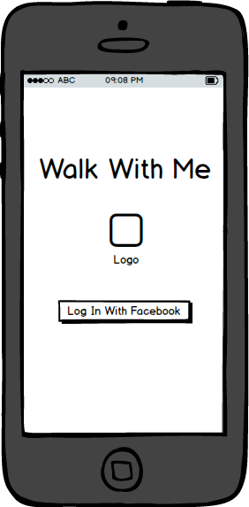

## Walk with Me

### Background

As a woman, being alone in the middle of the night can be an uncomfortable situation, no matter the neighborhood they’re in. Walk with Me is a mobile iOS application that uses GPS to locate other woman around to walk home with.

The app will feature a rating system for users to rate each other, keeping the experience for both users enjoyable each time. There will also be a strikes feature that will be used to ban users from using the application if they are reported as male or unpleasant to walk with.

### Functionality & MVP

With this application, users will be able to:

- [ ] Log in with Facebook API/oAuth.
- [ ] Input their current location and destination via Google Maps API.
- [ ] See other users around them via Map.
- [ ] See other user’s rating and name before matching up with them.
- [ ] Rate users based on their walking experience.
- [ ] Flag users via the Strike feature if the other user is a male or the walking experience was unpleasant.

### [Wireframes](images)

### Technologies & Technical Challenges

This application will be created using React Native and a Node.js(?) backend. The APIs implemented will be Facebook’s API for login and Google Maps API for location finding and routing.

Rendering will be done through React Native components.

The primary technical challenges will be:
- Rendering all nearby users on Google Maps relative to the current user.
- Matching users based on their routes.
- Managing server load as requests increase.
- Working with Node.js(?) backend.
- Creating an effective banning feature and subsequent implementation.
The main technical challenges will be working with new frameworks, languages, and APIs. A matching algorithm will be created based on multiple users starting and end location. The other technical challenge the keep in mind moving forward is how to ensure new users are women.

### Group Members & Work Breakdown

Our group consists of 4 members, Jeff Gronewold, Eileen Ho, Zach Haddad, and Yong Park.

Jeff’s primary responsibilities will be:

- Researching which backend technology to utilize with a React Native frontend for mobile.
- Implementing the backend technology and creating the database and associations.
- Owning backend portion of app implementation.

Eileen's primary responsibilities will be:

- Researching Google API w/ Zach.
- Implementing Google API w/ Zach.
- Creating matching algorithm w/ Zach.
- Creating front end portions of the application w/ Zach & Yong

Zach's primary responsibilities will be:

- Researching Google API w/ Eileen.
- Implementing Google API w/ Eileen.
- Creating matching algorithm w/ Eileen.
- Creating front end portions of the application w/ Eileein & Yong

Yong's primary responsibilities will be:

- Researching and setting up Facebook oAuth,
- Creating algorithm for further validating algorithm checks. (Use FB oAuth).
- Creating iOS store page and marketing the app.
- Producing the wireframes and designing each page of the app.
- Writing the repo's README, complete with screenshots and code snippets  

### Implementation Timeline

**Day 1**: Get started on the infrastructure of the extension, following [this guide]https://facebook.github.io/react-native/docs/getting-started.html) from Facebook.  By the end of the day, we will have:

- Completed ‘root’ file. Starting to building basic components. (Eileen/Zach)
- Backend setup for users/auth w/ relations. (Jeff)
- Facebook Auth research/ backend setup (Yong)

**Day 2**: Work on getting users to login and display a Google map screen to input their location.

- Backend setup for Maps. (Jeff)
- Front end implementation of Maps. Get user input working for current location and destination(Eileen & Zach). Bonus for getting routing working. Start working on matching algo.
- Work on better ways of validating women users for Fb auth. Finish login design (Yong)

**Day 3**: Dedicate this day to get the core feature of the app working, matching users with nearby users and by destination.

- Create/finish matching algorithm. Implement and test matching algorithm. (Eileen & Zach)
- Help with implementing backend algo. Troubleshoot any issues up to this point (Jeff)
- Start design for Google Maps page and user matching screen. (Yong).

**Day 4**: Finish up the application. Create user page and troubleshoot any issues overlooked so far. Polish up code base/refactor.
- Create/finish matching algorithm. Implement and test matching algorithm. Create front end for user profile. (Eileen & Zach & Jeff.)
- Finish design for Google Maps and user matching page. Start on user profile and on iOS store page (Yong)
- Backend for User Profile page. Fixing up bugs/issues (Jeff)

**Day 5**: Create demo page for chrome extension. By the end of the day:
- Write repo readme. (jeff)
- Mockup wireframes for how the iOS page will look (Yong)
- Grab nice looking screenshots from the chrome extension (Eileen)
- Make a few gifs that shows off the key features of the chrome extension (Zach)

### Plan for getting users and reviews
- Everyone on the team will share with their female friends in SF (localized testing first). Help spread the word through social media.
- Eileen will find an appropriate subreddit and make a post there to show off the chrome extension
- Yong & Zach find women oriented websites. Create twitter account and tweet at them to spread the word further.
