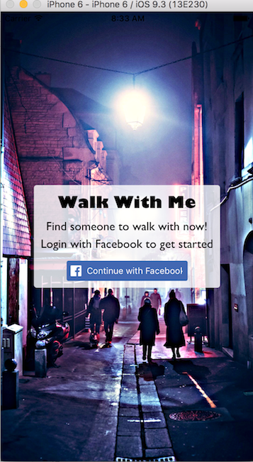
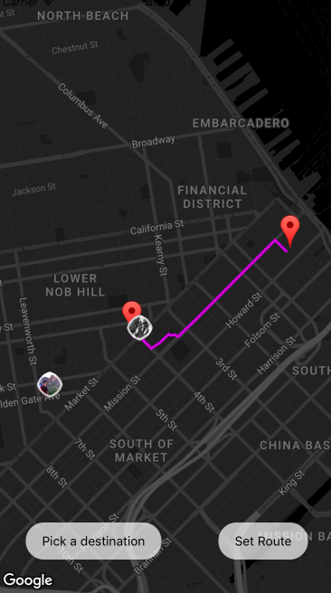
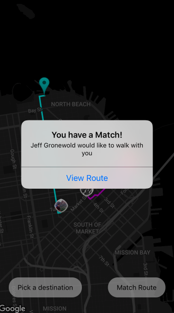
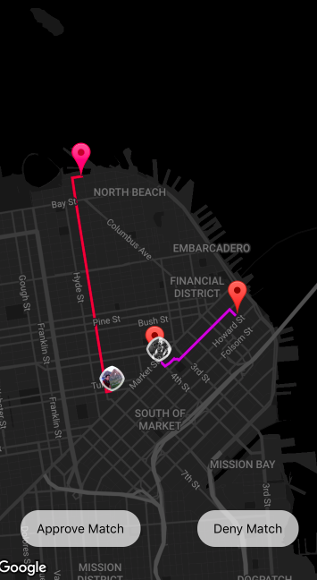

## Walk With Me

Why walk alone at night or through isolated neighborhoods when there are other women walking in a similar direction?  Walk With Me is a mobile iOS application built with React Native that matches female users to each other so that they can have someone to walk home with.

### Login

Users login through Facebook oAuth to confirm their identities and gender.  Upon successful login, users are directed to a map that shows their current location.

In order to find another woman walking in a similar direction, the user must first input her end destination.

A highlighted route will appear on the screen mapping her current location to her end destination.  If the route is correct, the user can then select "set route".

Once a user selects "set route", the map will be updated to show other users nearby with their set routes.

By clicking on the matches, the user can see another user's route.  The user can choose to match with another user,
or may receive an alert that someone wants to walk with her.

The map will then render both user's routes with the option to approve or deny the match.

### Technologies
  - React Native
    -react-native-maps
        -Main map screen
        -Directions via polyline rendering
    -react-native-fbsdk
        -FB OAuth
    -react-native-google-places
        -Destination search
  - Firebase
    -User authentication
    -Realtime database

### Implementation
